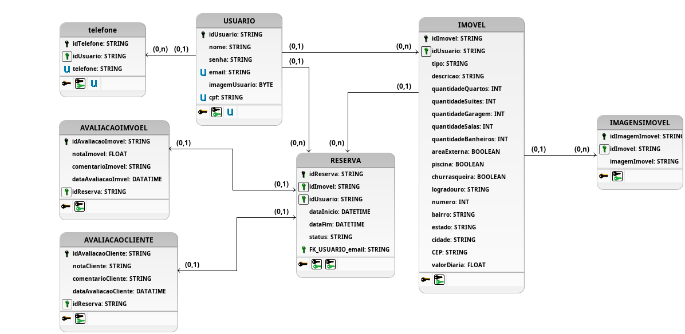

### Modelo Entidade-Relacionamento (ME-R)

#### Identificações das Entidades

* **USER**
* **PROPERTY**
* **RESERVE**
* **PROPERTYVALUATION**
* **CLIENTVALUATION**
* **PAYMENT**

#### Descrições das Entidades (Atributos)

* **USER** (<u>userId</u>, name, email, password, {phone}, cpf, userImage)
* **PROPERTY** (<u>propertyId</u>, type, description, numberOfBedroom, numberOfSuites, numberOfGarage, numberOfBathroom, numberOfRoom, outdoor, pool, barbecue, dailyRate, {propertyImages}, endereco(street, number, neighborhood, city, state, CEP))
* **RESERVE** (<u>reserveId</u>, dateStart, dateEnd, reserveStatus)
* **PROPERTYVALUATION** (<u>propertyValuationId</u>, noteProperty, commentProperty, datePropertyValuation)
* **CLIENTVALUATION** (<u>clientValuationId</u>, noteClient, commentClient, dateClientValuation)
* **PAYMENT** (<u>paymentId</u>, paymentValue, datePayment, paymentStatus)

#### Descrição dos Relacionamentos

* **USER have PROPERTY**
    * **Descrição:** Esta relação representa a posse de um imóvel por um usuário.
    * **Regra de Negócio:** Um **USER** pode possuir um ou vários **PROPERTIES** (`1,n`), mas um **PROPERTY** pertence a um e somente um **USER** (`1,1`).
    * **Cardinalidade:** (1:N)

* **USER makeReserve PROPERTY**
    * **Descrição:** Esta relação de negócio dá origem à entidade associativa `RESERVE`.
    * **Regra de Negócio:** Um **USER** pode fazer várias (`0,n`) reservas, e um **PROPERTY** pode ser reservado várias vezes (`0,n`).
    * **Cardinalidade:** (N:N)

* **RESERVE makePropertyValuation PROPERTYVALUATION**
    * **Descrição:** Define que uma avaliação do imóvel (`PROPERTYVALUATION`) só pode existir no contexto de uma reserva (`RESERVE`).
    * **Regra de Negócio:** Uma **RESERVE** pode ter no máximo uma **PROPERTYVALUATION** (`0,1`). Uma **PROPERTYVALUATION** pertence a uma e somente uma **RESERVE** (`1,1`).
    * **Cardinalidade:** (1:0,1)

* **RESERVE makeClientValuation CLIENTVALUATION**
    * **Descrição:** Define que uma avaliação do cliente (`CLIENTVALUATION`) só pode existir no contexto de uma reserva (`RESERVE`).
    * **Regra de Negócio:** Uma **RESERVE** pode ter no máximo uma **CLIENTVALUATION** (`0,1`). Uma **CLIENTVALUATION** pertence a uma e somente uma **RESERVE** (`1,1`).
    * **Cardinalidade:** (1:0,1)

* **USER do PAYMENT**
    * **Descrição:** Associa um pagamento a um usuário.
    * **Regra de Negócio (Conforme o Diagrama):** Um **USER** está associado a um e somente um **PAYMENT** (`1,1`). Um **PAYMENT** específico refere-se a um e somente um **USER** (`1,1`).
    * **Cardinalidade:** (1:1)

### Diagrama de Entidade-Relacionamento(DE-R)

### Diagrama Lógico de Dados(DLD)

### Modelo físico

### Histórico de Commits

|    Data    |   Tipo   |                     Descrição                    |
| :--------- | :------- | :----------------------------------------------- |
| 06/10/2025 | **feat** | Adiciona a descrição das entidades, diagrama de entidade-relacionamento, diagrama lógico de dados |
| 11/10/2025 | **fix** | Altera o nome das entidades, atributos e relações |