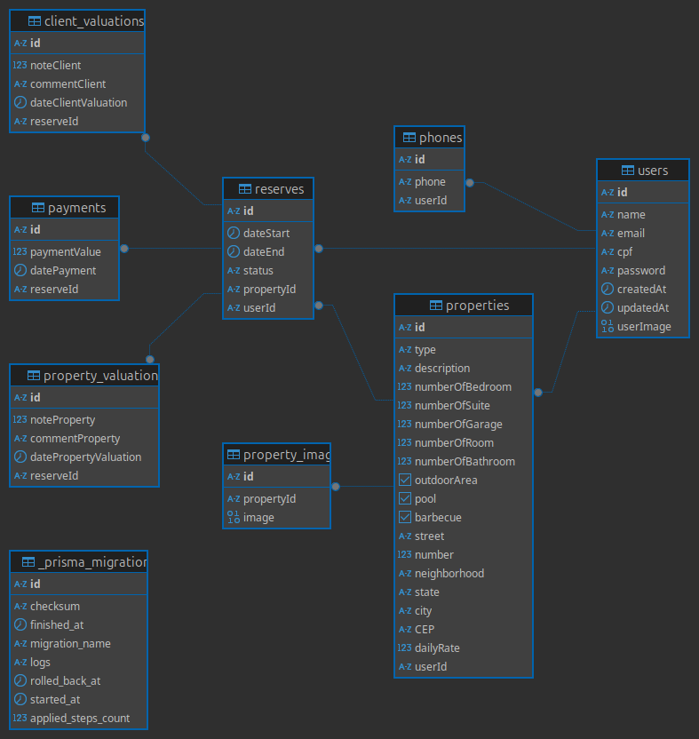

### Modelo Entidade-Relacionamento (ME-R)

#### Identificações das Entidades

* **USER**
* **PROPERTY**
* **RESERVE**
* **PROPERTYVALUATION**
* **CLIENTVALUATION**
* **PAYMENT**

#### Descrições das Entidades (Atributos)

* **USER** (<u>userId</u>, name, email, password, {phone}, cpf, userImage)
* **PROPERTY** (<u>propertyId</u>, type, description, numberOfBedroom, numberOfSuites, numberOfGarage, numberOfBathroom, numberOfRoom, outdoor, pool, barbecue, dailyRate, {propertyImages}, endereco(street, number, neighborhood, city, state, CEP))
* **RESERVE** (<u>reserveId</u>, dateStart, dateEnd, reserveStatus)
* **PROPERTYVALUATION** (<u>propertyValuationId</u>, noteProperty, commentProperty, datePropertyValuation)
* **CLIENTVALUATION** (<u>clientValuationId</u>, noteClient, commentClient, dateClientValuation)
* **PAYMENT** (<u>paymentId</u>, paymentValue, datePayment, paymentStatus)

#### Descrição dos Relacionamentos

* **USER have PROPERTY**
    * **Descrição:** Esta relação representa a posse de um imóvel por um usuário.
    * **Regra de Negócio:** Um **USER** pode possuir um ou vários **PROPERTIES** (`1,n`), mas um **PROPERTY** pertence a um e somente um **USER** (`1,1`).
    * **Cardinalidade:** (1:N)

* **USER makeReserve PROPERTY**
    * **Descrição:** Esta relação de negócio dá origem à entidade associativa `RESERVE`.
    * **Regra de Negócio:** Um **USER** pode fazer várias (`0,n`) reservas, e um **PROPERTY** pode ser reservado várias vezes (`0,n`).
    * **Cardinalidade:** (N:N)

* **RESERVE makePropertyValuation PROPERTYVALUATION**
    * **Descrição:** Define que uma avaliação do imóvel (`PROPERTYVALUATION`) só pode existir no contexto de uma reserva (`RESERVE`).
    * **Regra de Negócio:** Uma **RESERVE** pode ter no máximo uma **PROPERTYVALUATION** (`0,1`). Uma **PROPERTYVALUATION** pertence a uma e somente uma **RESERVE** (`1,1`).
    * **Cardinalidade:** (1:0,1)

* **RESERVE makeClientValuation CLIENTVALUATION**
    * **Descrição:** Define que uma avaliação do cliente (`CLIENTVALUATION`) só pode existir no contexto de uma reserva (`RESERVE`).
    * **Regra de Negócio:** Uma **RESERVE** pode ter no máximo uma **CLIENTVALUATION** (`0,1`). Uma **CLIENTVALUATION** pertence a uma e somente uma **RESERVE** (`1,1`).
    * **Cardinalidade:** (1:0,1)

* **USER do PAYMENT**
    * **Descrição:** Associa um pagamento a um usuário.
    * **Regra de Negócio (Conforme o Diagrama):** Um **USER** está associado a um e somente um **PAYMENT** (`1,1`). Um **PAYMENT** específico refere-se a um e somente um **USER** (`1,1`).
    * **Cardinalidade:** (1:1)

### Diagrama de Entidade-Relacionamento(DE-R)


### Diagrama Lógico de Dados(DLD)


### Diagrama Físico



### SQL de creação das tabelas

```sql
-- public.users definição

-- Drop table

-- DROP TABLE public.users;

CREATE TABLE public.users (
	id text NOT NULL,
	"name" text NOT NULL,
	email text NOT NULL,
	cpf text NOT NULL,
	"password" text NOT NULL,
	"createdAt" timestamp(3) DEFAULT CURRENT_TIMESTAMP NOT NULL,
	"updatedAt" timestamp(3) NOT NULL,
	"userImage" bytea NULL,
	CONSTRAINT users_pkey PRIMARY KEY (id)
);
CREATE UNIQUE INDEX users_cpf_key ON public.users USING btree (cpf);
CREATE UNIQUE INDEX users_email_key ON public.users USING btree (email);


-- public.phones definição

-- Drop table

-- DROP TABLE public.phones;

CREATE TABLE public.phones (
	id text NOT NULL,
	phone text NOT NULL,
	"userId" text NOT NULL,
	CONSTRAINT phones_pkey PRIMARY KEY (id),
	CONSTRAINT "phones_userId_fkey" FOREIGN KEY ("userId") REFERENCES public.users(id) ON DELETE CASCADE ON UPDATE CASCADE
);
CREATE UNIQUE INDEX phones_phone_key ON public.phones USING btree (phone);


-- public.properties definição

-- Drop table

-- DROP TABLE public.properties;

CREATE TABLE public.properties (
	id text NOT NULL,
	"type" text NOT NULL,
	description text NOT NULL,
	"numberOfBedroom" int4 NOT NULL,
	"numberOfSuite" int4 NOT NULL,
	"numberOfGarage" int4 NOT NULL,
	"numberOfRoom" int4 NOT NULL,
	"numberOfBathroom" int4 NOT NULL,
	"outdoorArea" bool NOT NULL,
	pool bool NOT NULL,
	barbecue bool NOT NULL,
	street text NOT NULL,
	"number" int4 NOT NULL,
	neighborhood text NOT NULL,
	state text NOT NULL,
	city text NOT NULL,
	"CEP" text NOT NULL,
	"dailyRate" float8 NOT NULL,
	"userId" text NOT NULL,
	CONSTRAINT properties_pkey PRIMARY KEY (id),
	CONSTRAINT "properties_userId_fkey" FOREIGN KEY ("userId") REFERENCES public.users(id) ON DELETE CASCADE ON UPDATE CASCADE
);


-- public.property_images definição

-- Drop table

-- DROP TABLE public.property_images;

CREATE TABLE public.property_images (
	id text NOT NULL,
	"propertyId" text NOT NULL,
	image bytea NOT NULL,
	CONSTRAINT property_images_pkey PRIMARY KEY (id),
	CONSTRAINT "property_images_propertyId_fkey" FOREIGN KEY ("propertyId") REFERENCES public.properties(id) ON DELETE CASCADE ON UPDATE CASCADE
);


-- public.reserves definição

-- Drop table

-- DROP TABLE public.reserves;

CREATE TABLE public.reserves (
	id text NOT NULL,
	"dateStart" timestamp(3) NOT NULL,
	"dateEnd" timestamp(3) NOT NULL,
	status text NOT NULL,
	"propertyId" text NOT NULL,
	"userId" text NOT NULL,
	CONSTRAINT reserves_pkey PRIMARY KEY (id),
	CONSTRAINT "reserves_propertyId_fkey" FOREIGN KEY ("propertyId") REFERENCES public.properties(id) ON DELETE CASCADE ON UPDATE CASCADE,
	CONSTRAINT "reserves_userId_fkey" FOREIGN KEY ("userId") REFERENCES public.users(id) ON DELETE CASCADE ON UPDATE CASCADE
);


-- public.client_valuations definição

-- Drop table

-- DROP TABLE public.client_valuations;

CREATE TABLE public.client_valuations (
	id text NOT NULL,
	"noteClient" float8 NOT NULL,
	"commentClient" text NULL,
	"dateClientValuation" timestamp(3) DEFAULT CURRENT_TIMESTAMP NOT NULL,
	"reserveId" text NOT NULL,
	CONSTRAINT client_valuations_pkey PRIMARY KEY (id),
	CONSTRAINT "client_valuations_reserveId_fkey" FOREIGN KEY ("reserveId") REFERENCES public.reserves(id) ON DELETE CASCADE ON UPDATE CASCADE
);
CREATE UNIQUE INDEX "client_valuations_reserveId_key" ON public.client_valuations USING btree ("reserveId");


-- public.payments definição

-- Drop table

-- DROP TABLE public.payments;

CREATE TABLE public.payments (
	id text NOT NULL,
	"paymentValue" float8 NOT NULL,
	"datePayment" timestamp(3) NOT NULL,
	"reserveId" text NOT NULL,
	CONSTRAINT payments_pkey PRIMARY KEY (id),
	CONSTRAINT "payments_reserveId_fkey" FOREIGN KEY ("reserveId") REFERENCES public.reserves(id) ON DELETE CASCADE ON UPDATE CASCADE
);
CREATE UNIQUE INDEX "payments_reserveId_key" ON public.payments USING btree ("reserveId");


-- public.property_valuations definição

-- Drop table

-- DROP TABLE public.property_valuations;

CREATE TABLE public.property_valuations (
	id text NOT NULL,
	"noteProperty" float8 NOT NULL,
	"commentProperty" text NULL,
	"datePropertyValuation" timestamp(3) DEFAULT CURRENT_TIMESTAMP NOT NULL,
	"reserveId" text NOT NULL,
	CONSTRAINT property_valuations_pkey PRIMARY KEY (id),
	CONSTRAINT "property_valuations_reserveId_fkey" FOREIGN KEY ("reserveId") REFERENCES public.reserves(id) ON DELETE CASCADE ON UPDATE CASCADE
);

```

### Histórico de Commits

|    Data    |   Tipo   |                     Descrição                    |
| :--------- | :------- | :----------------------------------------------- |
| 06/10/2025 | **feat** | Adiciona a descrição das entidades, diagrama de entidade-relacionamento, diagrama lógico de dados |
| 11/10/2025 | **fix**  | Altera o nome das entidades, atributos e relações |
| 28/10/2025 | **fix**  | Adiciona Diagrama fisico e SQL |