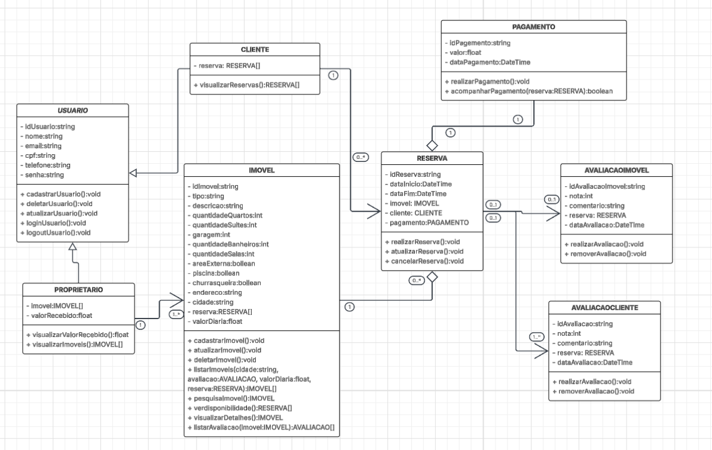

## Diagrama de Classes

Este diagrama de classes UML representa a estrutura de dados e as relações entre as entidades principais do sistema "Estadia Já". Ele detalha as classes, atributos e métodos, oferecendo uma visão clara de como os objetos se interagem no sistema.

### Descrição das Classes

A seguir, uma breve descrição de cada classe no diagrama:

* **USUARIO:** Representa a classe mãe dos meus tipos de usuários.
    * **Atributos:** `idUsuario`, `nome`, `email`, `cpf`, `telefone`, `senha`.
    * **Métodos:** `cadastroUsuario()`, `deletarUsuario()`, `atualizarUsuario()`, `loginUsuario()`, `logoutUsuario()`.

* **CLIENTE:** Representa os usuário que  busca e aluga imóveis.
    * **Atributos:** `reservas`.
    * **Métodos:** `visualizarReservas()`.

* **PROPRIETARIO:** Representa os usuário disponibiliza imóveis para aluguel.
    * **Atributos:** `imovel`, `valorRecebido`.
    * **Métodos:** `visualizarValorRecebido()`, `visualizarImoveis()`.

* **RESERVA:** Gerencia as reservas de imóveis feitas pelos clientes.
    * **Atributos:** `idReserva`, `dataInicio`,`imovel`, `cliente`, `dataFim`, `pagamento`.
    * **Métodos:** `realizarReserva()`, `atualizarReserva()`, `cancelarReserva()`.

* **PAGAMENTO:** Detalha a transação financeira de uma reserva.
    * **Atributos:** `idPagamento`, `valor`, `dataPagamento`.
    * **Métodos:** `realizaPagamento()`, `acompanharPagamento()`.

* **IMOVEL:** Representa as propriedades disponíveis para aluguel.
    * **Atributos:** `idImovel`, `tipo`, `enderecao`, `descricao`, `quantidadeQuartos`, `quantidadeSuites`,`garagemm`, `quantidadeBanheiros`,`quantidadeSalas`,`areaExterna`,`piscina`, `churrasqueira`, `cidade`, `reserva`, `valor`.
    * **Métodos:** `cadastrarImovel()`, `atualizarImovel()`, `deletarImovel()`, `listarImoveis()`, `pesquisarImovel()`, `verDisponibilidade()`, `visualizarDetalhes()``visualizarAvaliacoes()`.

* **AVALIACAOCLIENTE:** Representa as avaliações dos imóveis.
    * **Atributos:** `idAvaliacaoImovel`, `cliente`, `imovel`, `nota`, `comentario`, `dataAvaliacao`.
    * **Métodos:** `realizarAvaliacao()`, `removerAvaliacao()`.

* **AVALIACAOIMOVEL:** Representa as avaliações do cliente.
    * **Atributos:** `idAvaliacaoCliente`, `cliente`, `imovel`, `nota`, `comentario`, `dataAvaliacao`.
    * **Métodos:** `realizarAvaliacao()`, `removerAvaliacao()`.

### Relações entre as Classes

* **CLIENTE e RESERVA**: Um cliente pode ter múltiplas reservas, mas cada reserva pertence a um único cliente (relação de 1 para N).
* **RESERVA e PAGAMENTO**: Cada reserva tem um e somente um pagamento associado (relação de 1 para 1).
* **PROPRIETARIO e IMOVEL**: Um proprietário pode ter muitos imóveis, e cada imóvel pertence a um proprietário (relação de 1 para N).avaliações, mas cada avaliação é feitas por um proprietario(relação de 1 para N).
* **IMÓVEL e RESERVA**: Um imóvel pode ser objeto de várias reservas, e cada reserva se refere a um único imóvel (relação de 1 para N).
* **RESERVA e AVALIACAOIMOVEL**: Uma reserva pode ser avaliada uma vez e uma avaliação se refere a uma reserva.
* **RESERVA e AVALIACAOCLIENTE**: Uma reserva pode ser avaliada uma vez e uma avaliação se refere a uma reserva.

### Link para o Diagrama

Você pode acessar e editar este diagrama de classes diretamente no Lucidchart através do link abaixo:

[Diagrama de CLasses no LucidChart](https://lucid.app/lucidchart/b7cc4921-8546-4736-9e75-fded6500042b/edit?viewport_loc=-944%2C9%2C3777%2C1509%2C0_0&invitationId=inv_4f0bb6e0-f0f3-484e-ae32-f31afa6f854d)

### Histórico de Commits

|    Data    |   Tipo   |                     Descrição                    |
| :--------- | :------- | :----------------------------------------------- |
| 11/09/2025 | **feat** | Adiciona o diagrama de classes e a sua descrição |
| 04/10/2025 | **fix** | Corrige as relações entre as classes do diagrama de classes |

